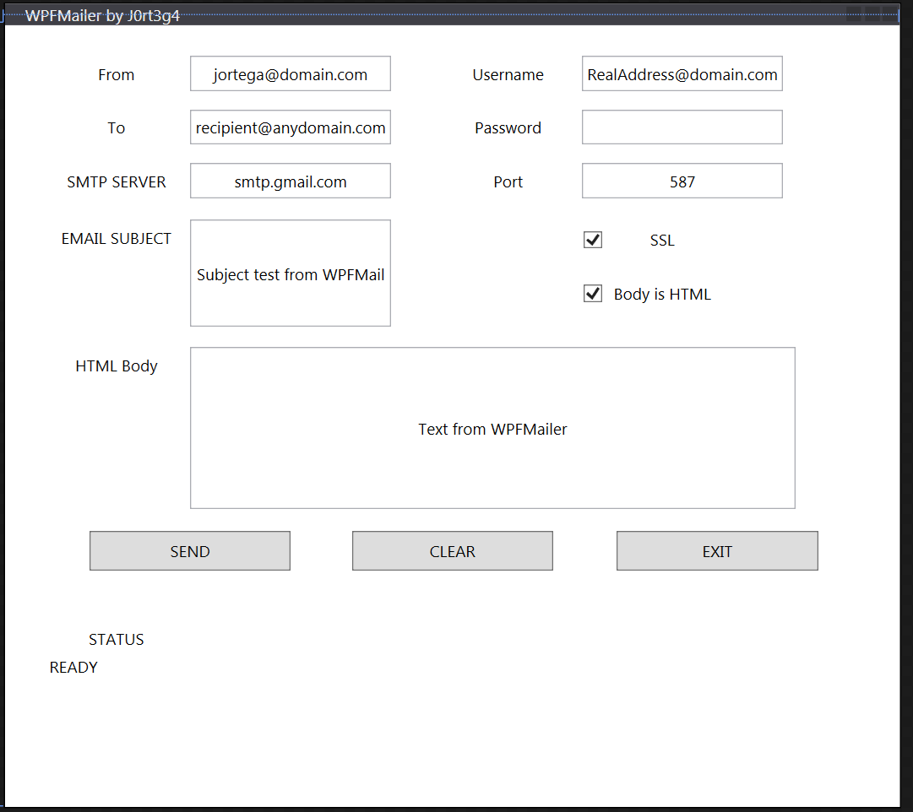

#WPFMAilCore

## Mail Sender for any SMTP

Fully customizable and it works on Windows and MAC.

Just fill out the required fields and use it 

This was done completely under ASP.NET CORE 3.1

## Fully Customizable 

> [!IMPORTANT]
> This was created because there was a need in the IT Support for testing with a quick and efficient way to test out accounts for sending emails from SMTP services and from the need of old printers to be configured with services like office 365 using (this official article from Microsoft)[https://docs.microsoft.com/exchange/mail-flow-best-practices/how-to-set-up-a-multifunction-device-or-application-to-send-email-using-office-3#option-3-configure-a-connector-to-send-mail-using-office-365-smtp-relay)

